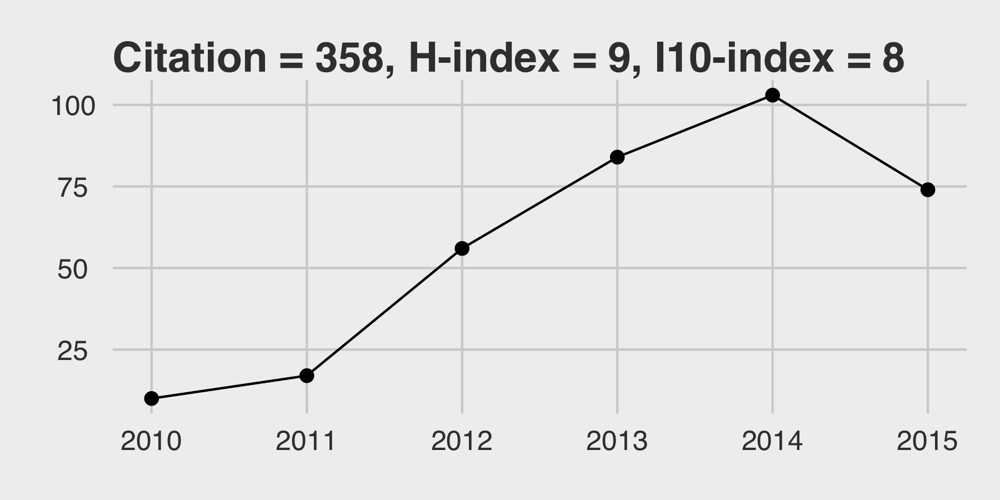

Guangchuang Yu
============

----

-------------------------------------------------------------    --------------------------
School of Public Health, The University of Hong Kong                         (852)-62269693
L5-14, 5/F, Laboratory Block, Faculty of Medicine Building       <guangchuangyu@gmail.com>
22 Sassoon Road, Pokfulam, Hong Kong                             <https://guangchuangyu.github.io>
-------------------------------------------------------------    --------------------------
----

Education
---------

2013-2017 (expected)
:   **PhD**; The University of Hong Kong; *Evolution Study of Influenza A Virus*

2006-2009
:   **MSc**; Anhui Medical University; *Biochemistry and Molecular Biology*

2001-2005
:   **BSc**; South China Agricultural University; *Biotechnology*

2015
:   Institut Pasteur, Paris; *Train the Trainers 2015*

Professional Experience
----------

2015
:   **INDA Steering Committee**; International Network for Data Analysis, Institut Pasteur

2009-2013
:   **Bioinformatician**; College of Life Science and Technology, Jinan University

2007-2009
:   **Visiting Student**; Beijing Institute of Radiation Medicine

Software Development
--------------------

[ChIPseeker](https://guangchuangyu.github.io/ChIPseeker)
:   ChIP peak Annotation, Comparison and Visualization

[clusterProfiler](https://guangchuangyu.github.io/clusterProfiler)
:   Statistical analysis and visualization of functional profiles for genes and gene clusters

[DOSE](https://guangchuangyu.github.io/DOSE)
:   Disease Ontology Semantic and Enrichment analysis

[emojifont](https://cran.r-project.org/web/packages/emojifont/index.html)
:   Using emoji font in both 'base' and 'ggplot2' graphics

[ggtree](https://guangchuangyu.github.io/ggtree)
:   Visualization and annotation of phylogenetic trees with their covariates and other associated data

[GOSemSim](https://guangchuangyu.github.io/GOSemSim)
:   GO and gene samantic similarity measurement

[ReactomePA](https://guangchuangyu.github.io/ReactomePA)
:   Reactome pathway analysis

Awards
------

2013-2017
:   Postgraduate Studentships (for PhD students at The University of Hong Kong)

2012
:   Best paper of the year 2010, Journal of Integrated OMICS.

Grants
------
2013 (completed)
:   PI, Investigate functions of hnRNPK in regulating cytokinesis of human lung cancer cell, Fundamental Research Funds for the Central Universities (21613414), ￥100,000

2011 (completed)
:   PI, Dynamic proteomic analysis of HeLa cell cycle, Fundamental Research Funds for the Central Universities (21611303), ￥20,000

Professional Services
------------------
**Reviewer:** BMC Bioinformatics, Computational Biology and Chemistry, R Journal 

<!--
Programming Skills
-----------------

### R

+ More than 8 years of experience programming in R.
+ developed packages in font support (emojifont), semantic similarity measure (GOSemSim, DOSE), ontology & pathway analysis (DOSE, clusterProfiler, ReactomePA), ChIP-seq analysis (ChIPseeker), phylogenetic data import and visualization (ggtree).
+ Contribution to MSnbase (MS-based Proteomics).

### Unix

+ More than 14 years of experience (Linux & BSD).
+ Experience of server setup, management and application deployment.

### Other

+ Good knowledge of Git, $\LaTeX$ Bash and Java.
+ Basic knowledge of C, Perl, Python and Matlab.

Languages
--------------
Teochew
:   Native language

Chinese Mandarin
:   Very fluent. Complete professional competence.

Cantoese
:   Very fluent.

English
:   fluent.

-->

Publications
------------

> Citation = 542,
> H-index = 11,
> I10-index = 13

> (data from [Google Scholar](https://scholar.google.com/citations?user=DO5oG40AAAAJ&hl=en), July 2016)

<link rel='stylesheet' href=css/morris.css>

<!--

-->
1. __G Yu__, DK Smith, H Zhu, Y Guan, TTY Lam^\*^. ggtree: an R package for visualization and annotation of phylogenetic trees with their covariates and other associated data. __*Methods in Ecology and Evolution*__. revised.
92. __G Yu__, QY He^\*^. [ReactomePA: an R/Bioconductor package for reactome pathway analysis and visualization](http://pubs.rsc.org/en/Content/ArticleLanding/2016/MB/C5MB00663E). __*Molecular BioSystems*__. 2016, 12(2):477-479.
93. __G Yu__^\*^, LG Wang, QY He^\*^. [ChIPseeker: an R/Bioconductor package for ChIP peak annotation, comparision and visualization](http://bioinformatics.oxfordjournals.org/cgi/content/abstract/btv145). __*Bioinformatics*__. 2015, 31(14):2382-2383.
94.	__G Yu__^\*^, LG Wang, GR Yan, QY He^\*^. [DOSE: an R/Bioconductor package for Disease Ontology Semantic and Enrichment analysis](http://bioinformatics.oxfordjournals.org/cgi/content/abstract/btu684). __*Bioinformatics*__. 2015, 31(4):608-609.
95.	__G Yu__^†^, LG Wang^†^, XH Meng, QY He^\*^. [LXtoo: an integrated live Linux distribution for the bioinformatics community](http://www.biomedcentral.com/1756-0500/5/360/). __*BMC Research Notes*__. 2012, 5(1):360.
96.	__G Yu__, LG Wang, Y Han, QY He^\*^. [clusterProfiler: an R package for comparing biological themes among gene clusters](http://online.liebertpub.com/doi/abs/10.1089/omi.2011.0118). __*OMICS: A Journal of Integrative Biology*__. 2012, 16(5):284-287.
97.	__G Yu__, QY He^\*^. [Functional similarity analysis of human virus-encoded miRNAs](http://www.jclinbioinformatics.com/content/1/1/15/abstract). __*Journal of Clinical Bioinformatics*__. 2011, 1(1):15.
98.	__G Yu__^†^, CL Xiao^†^, X Bo, CH Lu, Y Qin, S Zhan, QY He^\*^. [A new method for measuring functional similarity of microRNAs](http://www.jiomics.com/index.php/jio/article/view/21). __*Journal of Integrated OMICS*__. 2011, 1(1):49-54.
99.	__G Yu__^†^, CL Xiao^†^, CH Lu^†^, HT Jia, F Ge, W Wang, XF Yin, HL Jia, JX He^\*^, QY He^\*^. [Phosphoproteome profile of human lung cancer cell line A549](http://pubs.rsc.org/en/Content/ArticleLanding/2011/MB/C0MB00055H). __*Molecular BioSystems*__. 2011, 7(2):472-479.
100. __G Yu__^†^, F Li^†^, Y Qin, X Bo^\*^, Y Wu, S Wang^\*^. [GOSemSim: an R package for measuring semantic similarity among GO terms and gene products](http://bioinformatics.oxfordjournals.org/cgi/content/abstract/26/7/976). __*Bioinformatics*__. 2010, 26(7):976-978.
199. X Sun^†^, __G Yu__^†^, Q Xu, N Li, C Xiao, X Yin, K Cao, J Han, QY He^\*^. [Putative cobalt- and nickel-binding proteins and motifs in *Streptococcus pneumonia*](http://pubs.rsc.org/en/content/articlelanding/2013/mt/c3mt00126a). __*Metallomics*__. 2013, 5(7):928-935.
200. YY Zhu^†^, __G Yu__^†^, Y Zhang, Z Xu, YQ Huang, GR Yan^\*^, QY He^\*^. [A novel andrographolide derivative AL-1 exerts its cytotoxicity on K562 cells through a ROS-dependent mechanism](http://onlinelibrary.wiley.com/doi/10.1002/pmic.201200273/abstract). __*Proteomics*__, 2013, 13(1):169-178.
988. XY Yang, K He, G Du, X Wu, __G Yu__, Y Pan, G Zhang, X Sun, QY He. Integrated Translatomics with Proteomics to Identify Novel Iron–Transporting Proteins in *Streptococcus pneumoniae*. __*Frontiers Microbiology*__. 2016, 7:78.
989. PY Huang, CCD Lee, CH Yip, CL Cheung, __G Yu__, TTY Lam, DK Smith, H Zhu^\*^, Y Guan^\*^. [Genetic characterization of highly pathogenic H5 influenza viruses from poultry in Taiwan, 2015](http://www.sciencedirect.com/science/article/pii/S1567134815300721). __*Infection, Genetics and Evolution*__. 2016, 38:96-100.
990. SH Xu, JZ Huang, ML Xu, __G Yu__, XF Yin, D Chen^\*^, GR Yan^\*^. [ACK1 Promotes Gastric Cancer Epithelial-Mesenchymal Transition and Metastasis through AKT-POU2F1-ECD Signaling](http://onlinelibrary.wiley.com/doi/10.1002/path.4515/abstract). __*The Journal of Pathology*__. 2015, 236(2):175-185.
991. Z Guo, J Han, XY Yang, K Cao, K He, G Du, G Zeng, L Zhang, __G Yu__, Z Sun, QY He^\*^, X Sun^\*^. [Proteomic analysis on the copper resistance of *Streptococcus pneumonia*](http://pubs.rsc.org/en/content/articlelanding/2015/mt/C4MT00276H). __*Metallomics*__. 2015, 7(3):448-454.
992. XY Yang, L Zhang, J Liu, N Li, __G Yu__, K Cao, J Han, G Zeng, Y Pan, X Sun^\*^, QY He^\*^. [Proteomic analysis on the antibacterial activity of a Ru(II) complex against *Strepococcus pneumonia*](http://www.sciencedirect.com/science/article/pii/S1874391914005521). __*Journal of Proteomics*__. 2015, 115:107-116.
993. N Wang^†^, J Zhang^†^, L Zhang, XY Yang, N Li, __G Yu__, J Han, K Cao, Z Guo, X Sun^\*^, QY He^\*^. [Proteomic analysis of putative heme-binding proteins in *Streptococcus pyogenes*](http://pubs.rsc.org/en/content/articlelanding/2014/mt/c4mt00027g). __*Metallomics*__. 2014, 6(8):1451-1459.
994. H Sun^\*^, J Weng, __G Yu__, RH Massawe. [A DNA-Based Semantic Fusion Model for Remote Sensing Data](http://www.plosone.org/article/info%3Adoi%2F10.1371%2Fjournal.pone.0077090). __*PLoS One*__. 2013, 8(10):e77090.
995. GR Yan^†^, Z Tan^†^, Y Wang, ML Xu, __G Yu__, Y Li^\*^, QY He^\*^. [Quantitative Proteomics Characterization on the Anti-tumor Effects of Isodexyelephantopin against Nasopharyngeal Carcinoma](http://onlinelibrary.wiley.com/doi/10.1002/pmic.201300152/abstract). __*Proteomics*__. 2013, 13(21):3222-3232.
996. J Li, X Lu, Q Wu, __G Yu__, Z Xu, L Qiu, Z Pei, Y Lin, J Pang^\*^. [Design, SAR, angiogenic activities evaluation and pro-angiogenic mechanism of new m
arine cyclopeptide analogs](http://www.eurekaselect.com/107734/article). __*Current Medicinal Chemistry*__. 2013, 20(9):1183-1194. 
997. Y Han, __G Yu__, H Sarioglu, A Caballero-Martinez, F Schlott, M Ueffing, H Haase, C Peschel, AM Krackhardt^\*^. [Proteomic investigation of the interactome of FMNL1 in hematopoietic cells unveils a role in calcium-dependent membrane plasticity](http://www.sciencedirect.com/science/article/pii/S1874391912007567). __*Journal of Proteomics*__. 2013, 78:72-82.
998. Y Ma^†^, J Yang^†^, X Fan^†^, H Zhao, W Hu, Z Li, __G Yu__, X Ding, J Wang, X Bo, X Zheng, Z Zhou^\*^, S Wang^\*^. [Cellular MicroRNA let-7c Inhibits M1 Protein Expression of the H1N1 Influenza A Virus in Infected Human Lung Epithelial Cells](http://onlinelibrary.wiley.com/doi/10.1111/j.1582-4934.2012.01572.x/abstract). __*Journal of Cellular and Molecular Medicine*__. 2012, 16(10):2539-2546.
999. GR Yan^†^, FY Zhou^†^, BL Dang, Y Zhang, __G Yu__, X Liu, QY He^\*^. [Genistein-induced mitotic arrest of gastric cancer cells by downregulating KIF20A, a proteomics study](http://onlinelibrary.wiley.com/doi/10.1002/pmic.201100652/abstract). __*Proteomics*__. 2012, 12(14):2391-2399. 
1000. X Sun^†^, XY Yang^†^, XF Yin, __G Yu__, CL Xiao, X He, QY He^\*^. [Proteomic Analysis of Membrane Proteins from *Streptococcus pneumoniae* with Multiple Separation Methods plus High Accuracy Mass Spectrometry](http://www.liebertonline.com/doi/abs/10.1089/omi.2010.0133). __*OMICS: A Journal of Integrative Biology*__. 2011, 15(10):683-694.

Book Chapters
-----------------
1. __G Yu__, "Bioinformatics II", in "Functional Protein Research", 385-425, Qing-Yu He (*Eds*), __*Science Press*__, 2012.

    (China’s Twelfth Five-Year National Important Books Project, in Chinese)

Conference Presentations
-----------------
2016
:   **ggtree for visualization and annotation of phylogenetic trees** (invited), 
	The 9^th^ China-R Conference, Renmin University of China, Beijing, May. 2016

Conference Posters
-----------------
2015
:   **ggtree: an *R* package for visualization and annotation of phylogenetic tree with different types of meta-data**, 
	The 20^th^ Research Postgraduate Symposium, The University of Hong Kong, Hong Kong, Dec. 2015
